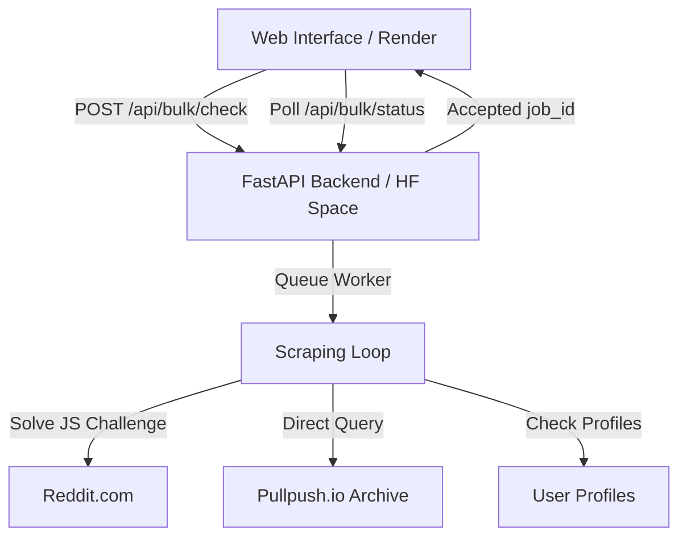

# Reddit Inspector: Developer Manual & System Architecture

This document provides a comprehensive technical overview of the **Reddit Inspector** architecture, its scraping bypass mechanisms, database integrations, author verification pipelines, and deployment structures.

---

## 1. System Overview

Reddit Inspector is a bulk-audit system designed to determine the status of Reddit content (posts and comments) and verification states of their authors (active, suspended, deleted) under strict stealth conditions.



---

## 2. Frontend Architecture (`static/`)

The frontend is a single-page application (SPA) optimized for screen space and built using modern CSS layout patterns and vanilla JavaScript.

### Key Files
- **[index.html](file:///home/harshdeep/Desktop/bulkreddit/static/index.html)**: Declares a glassmorphic dashboard container that dynamically spans `100%` viewport width. It uses semantic HTML5 components (header, grid columns, tables).
- **[style.css](file:///home/harshdeep/Desktop/bulkreddit/static/style.css)**: Implements the premium pitch-black layout (`#020204`) featuring:
  - Apple-style inset shadows (`inset 0 1px 0 rgba(255,255,255,0.05)`) on glass cards.
  - Vibrant violet/cyan neon gradients (`#a78bfa` and `#22d3ee`) for focus glows.
  - Fully custom styled scrollbars.
  - High-visibility badges for content status (LIVE, DELETED, REMOVED, ERROR) and author status (ACTIVE, SUSPENDED, DELETED, PENDING).
- **[app.js](file:///home/harshdeep/Desktop/bulkreddit/static/app.js)**: Handles user interaction, form validation, and asynchronous polling:
  1. Captures form inputs and submits URLs to `/api/bulk/check`.
  2. Spawns a progressive polling interval checking `/api/bulk/status/{job_id}` every 2 seconds.
  3. Dynamically renders rows as results return from the API.
  4. While the scraping job is running, displays a gray `PENDING` badge for authors because author status checks are deferred to run at the end.
  5. Implements local keyword search, content-type filtering tabs, and CSV/JSON/Excel report generators.

---

## 3. Backend Architecture (`api.py`)

The backend is built with **FastAPI** and utilizes **cffi-requests** (`curl_cffi`) for advanced browser impersonation, enabling it to bypass TLS fingerprinting and scraper protection rules.

### A. The Reddit JS Challenge Solver
When a guest request hits Reddit directly from a residential proxy or datacenter IP, Reddit serves a lightweight JavaScript verification page instead of returning content. 
The backend handles this by establishing a cookie session using `establish_session`:

```python
async def establish_session(proxy: Optional[str] = None) -> cffi_requests.AsyncSession:
    # 1. Fetch challenge page
    resp = await session.get("https://www.reddit.com/", headers=headers)
    
    # 2. Extract challenge parameters
    match = re.search(r'name="challenge"\s+value="([^"]+)"', html)
    # 3. Solve the duplicate string challenge
    solution = challenge + challenge
    
    # 4. POST the verification token
    await session.post("https://www.reddit.com/verify", data={
        "challenge": challenge,
        "solution": solution
    })
    
    # 5. Session now contains authorization cookies (edgebucket, loid, csrf_token, etc.)
```

### B. Bandwidth Optimization (Stealth Head Checks)
To resolve shortlinks (`redd.it` or `/s/` deep redirects) without wasting bandwidth on full HTML downloads, the backend initiates a lightweight `GET` request disabling automatic redirects. This allows extraction of the target URL directly from the `Location` header in under 100 milliseconds:
```python
resp = await session.get(url, allow_redirects=False, timeout=5.0)
resolved_url = resp.headers.get("Location")
```

### C. The Pullpush Archive Fallback
When a Reddit post or comment is removed by moderators or deleted by the user, its details are wiped from Reddit's live servers. The backend queries the **Pullpush.io** public archive database to recover the author's username:
1. **Direct-First Fallback**: Direct queries without a proxy are performed first because Pullpush does not block direct requests, while proxies often trigger connection timeouts (`curl: (28)`).
2. **Proxy Fallback**: If a direct request fails, it falls back to the residential proxy.
3. **Fail-Fast**: Set to a `5s` timeout limit per endpoint to prevent worker starvation.

### D. Author Status Verification Pipeline
Once all URL contents have been resolved, the backend performs user profile verification:
1. Checks for explicit API fields (`is_suspended`) in `about.json`.
2. Flags shadowbanned profiles (profiles returning `200 OK` but containing no custom subreddit field).
3. If profile returns `404 Not Found` (either deleted or suspended), queries the HTML page `https://old.reddit.com/user/{username}/` directly:
   - If HTML page contains `"suspended"` or `"suspension"`, the user is **suspended/banned**.
   - Otherwise, the user is **deleted**.

### E. Pullpush Direct Debug Endpoint
We exposed a direct testing endpoint `/debug/pullpush/{post_id}` (supporting an optional `?comment_id={comment_id}`) to query and inspect the Pullpush archive cache resolver without running full bulk checks.

---

## 4. Source Code References

### Complete Backend Controller (`api.py`)
See the full code implementation of the FastAPI backend in [api.py](file:///home/harshdeep/Desktop/bulkreddit/api.py).

### Complete Frontend stylesheet (`static/style.css`)
See the customized styling rules in [static/style.css](file:///home/harshdeep/Desktop/bulkreddit/static/style.css).

### Complete Frontend JS script (`static/app.js`)
See the interactive dashboard rendering engine in [static/app.js](file:///home/harshdeep/Desktop/bulkreddit/static/app.js).

---

## 5. Deployment Setup

The system is split into two automated build setups:
1. **Frontend Deployment (Render)**:
   - Placed on a static hosting bucket connected directly to the GitHub repository `https://github.com/Harshdeep72/reddit-inspector.git`.
   - Rebuilds and deploys instantly upon git pushes to the `main` branch.
2. **Backend Space (Hugging Face)**:
   - Placed inside a Docker Space container running on `https://huggingface.co/spaces/harrry953489/reddit-inspector-api`.
   - Built using the custom [Dockerfile](file:///home/harshdeep/Desktop/bulkreddit/Dockerfile) which installs curl dependencies and serves FastAPI on port 7860 via Uvicorn.
